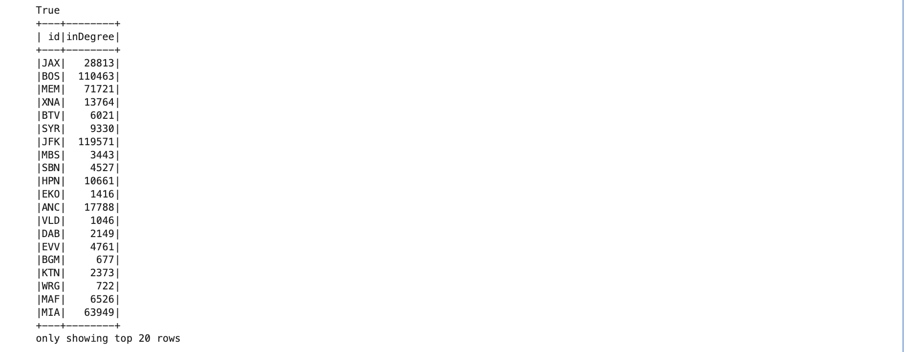
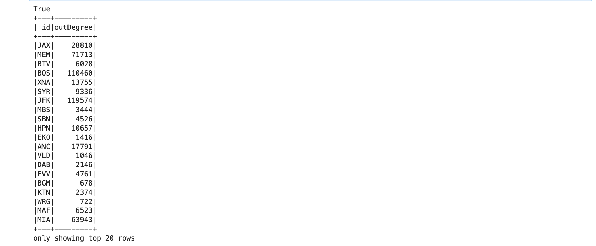
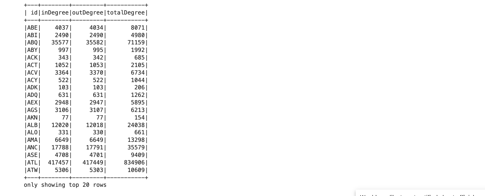
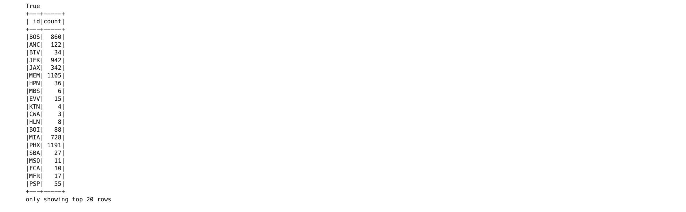

# BigData 2025 Projects Repository

Project [Big Data](https://courses.cs.ut.ee/2025/bdm/spring/Main/HomePage) is provided by [University of Tartu](https://courses.cs.ut.ee/).

Students: Marielle Lepson, Karel Paan, Andre Ahuna, Aksel Õim

# Project 3: Analysing Flight Interconnected Data
The objective of this project is to use Spark’s APIs to analyze the flight interconnected data
to understand the popularity of the airports and flight patterns.

## Data
The 2009.csv data file contains information of U.S. domestic airline flights in 2009. 
Each row represents a single flight and it includes information such as flight date, airline, flight number, origin and destination airports, scheduled and actual times,
delays, cancellation and etc.

The project's data is in cvs file named `2009.csv`. 

The full data file can be obtained via this [link](https://drive.google.com/file/d/1trFtRCe3xPBLr90hIWBF__OqppEnJPR_/view?usp=sharing).

### Flight Interconnected Data 
Columns:
- **FL_DATE**: Flight date, represents the date of the flight
  - *Example:* `2009-01-01`

- **OP_CARRIER**: Carrier code, the airline operating the flight
  - *Example:* `XE`

- **OP_CARRIER_FL_NUM**: Flight number assigned by the carrier
  - *Example:* `1204`

- **ORIGIN**: Departure airport code
  - *Example:* `DCA`

- **DEST**: Arrival airport code
  - *Example:* `EWR`

- **CRS_DEP_TIME**: Scheduled departure time
  - *Example:* `1100`

- **DEP_TIME**: Actual departure time
  - *Example:* `1058.0`

- **DEP_DELAY**: Departure delay in minutes. Negative if early
  - *Example:* `-2.0`

- **TAXI_OUT**: Taxi-out time in minutes (gate to takeoff)
  - *Example:* `18.0`

- **WHEELS_OFF**: Time when wheels left the ground
  - *Example:* `1116.0`

- **WHEELS_ON**: Time when wheels touched down
  - *Example:* `1158.0`

- **TAXI_IN**: Taxi-in time in minutes 
  - *Example:* `8.0`

- **CRS_ARR_TIME**: Scheduled arrival time
  - *Example:* `1202`

- **ARR_TIME**: Actual arrival time
  - *Example:* `1206.0`

- **ARR_DELAY**: Arrival delay in minutes. Negative if early
  - *Example:* `4.0`

- **CANCELLED**: Whether the flight was canceled (1.0 = yes, 0.0 = no)
  - *Example:* `0.0`

- **CANCELLATION_CODE**: Reason for cancellation
  - *Example:* `A` (Carrier)

- **DIVERTED**: Whether the flight was diverted (1.0 = yes, 0.0 = no) 
  - *Example:* `0.0`

- **CRS_ELAPSED_TIME**: Scheduled flight duration in minutes
  - *Example:* `62.0`

- **ACTUAL_ELAPSED_TIME**: Actual flight duration in minutes
  - *Example:* `68.0`

- **AIR_TIME**: Time spent in the air (minutes)
  - *Example:* `42.0`

- **DISTANCE**: Flight distance in miles
  - *Example:* `199.0`

- **CARRIER_DELAY**: Delay caused by the airline
  - *Example:* `null` or `15.0`

- **WEATHER_DELAY**: Delay caused by weather conditions
  - *Example:* `null` or `10.0`

- **NAS_DELAY**: Delay caused by National Airspace System
  - *Example:* `null` or `5.0`

- **SECURITY_DELAY**: Delay due to security reasons
  - *Example:* `null` or `0.0`

- **LATE_AIRCRAFT_DELAY**: Delay due to a previous flight arriving late
  - *Example:* `null` or `20.0`

- **Unnamed: 27**: Extra column with all values as `null`

## Requirements

### Software, libraries and data files
Software:
- Docker
- Jupyter Notebook
- Docker Compose

Data Files:  
- A CSV file, named `/data/2009.csv`. The file size is 802,2 MB.

### Setup
- Save csv file to /data location
- Navigate to project3 directory `cd project3`
- Start the container with `docker compose up -d`.
- Access the project on http://localhost:8891/lab/tree/notebook.ipynb

## Queries 
### Query 0
Description: Read the csv file and create a graph using Graphframes in the Spark environment.
Solution: 
- In the first cell, the code initialized a PySpark SparkSession with Delta Lake support and includes GraphFrames library for graph processing.
It configures memory settings and sets Spark SQL extensions for Delta operations.
- In cell 2, we import necessary functions and classes for graph analysis using GraphFrames in PySpark. We import GraphFrame for graph operations and seceral PySpark SQL functions like
col, coalesce, lit and sum for dataframe transformations.
- In cell 3, we read the CSV file ( 2009.csv) located in the /.data directory into the spark dataframe. Th header=True, tells Spark to read the first row as a header.
- In cell 4, we create a list of unique airports by selecting origin (ORIGIN) and destination (DEST), columns and renaming them to one common column id, then removing duplicates. These serve as nodes of the graph. Then we define the directed edges, that represent flights, where each edge goes from source to destination airport. Then we create the GraphFrame graph object using the nodes and edges defined earlier to create flight network.
- In cell 5, we persist the GraphFrame in memory using gf.persist(), this improves performance for repeated graph operations. The vertices (v) contain a single column id and edges contain two columns src and dst.
`GraphFrame(v:[id: string], e:[src: string, dst: string])`
 
Analysis: The CSV file is successfully read into dataframe.
All the necessary functions, classes and Graphframes are imported. A graph object is created, where nodes represent airports (using their codes) and edges represent direct flights between them.

### Query 1
Description: Compute different statistics : in-degree, out-degree, total degree and triangle count.
Solution: 
- In cell 6, gf.InDegrees returns a dataframe where each row contains an airport (by id) and its in-degree, which is the number of incoming flights. Meaning how many times it appeared as a destination.
- In cell 7, gf.OutDegrees returns a dataframe with each airport (id) and its out-degree, representing how many flights went out from airports.
- In cell 8, we calculate the total degree for each airport. We first do outer join on in_degree and out_degree dataframes using airport id. This means that airports appear only in one. Then we use coalesce function to replace any null values. This is important for airports missing either in-degree or out-degree. Then we display each airports inDegree, outDegree and totalDegree.
- In cell 9, we compute the triangle count for each airport in the graph.  triangleCount() runs the triangle count algorithm, which finds the count of triangles each airport is part of. A triangle represents closed loop where all three airports are directy connected to each other by flights. Then we display each airport along with the number of triangles it participates in. This helps to identify highly interconnected airports. 

Analysis:
I added images here to visualize some results. These tables are not sorted, but for analysing I used orderBy() to visualize the highest and lowest counts results. 
1) In-degree
This table shows the number of incoming flights for each airport. After sorting, the highest in-degree is at ATL with 417 457 incoming flights, followed by ORD (313 769) and DFW (264 398). JFK has 119 571 and BOS has 110 463, also ranking among the busiest. The lowest in-degree is seen at PIR with just 3 flights and others like RHI (41) and BJI (55) show very limited inbound traffic.

3) Out-degree
This table shows the number of outgoing flights per airport. After sorting, the highest out-degree again belongs to ATL with 417 449 flights, followed by ORD (313 848) and DFW (264 396). JFK (119 574) and BOS (110 460) continue to appear among the busiest. On the lower end, PIR (3), RHI (41), and BJI (54) show the lowest out-degree, showing minimal departures.

5) Total degree
This table reflects the overall activity (incoming + outgoing) per airport.  After sorting, ATL leads with a total degree of 834 906, making it the most active airport in the dataset. Other high-traffic airports are ORD (627 617) and DFW (528 794). But, PIR has the lowest total degree at 6, followed by RHI (82) and BJI (109), which shows extremely limited overall flight activity.

7) Triangle count
This table shows how many three-airport roundtrip loops (triangles) each airport is part of, revealing local connectivity and network density. After sorting, The highest triangle count is at ATL (1761), followed by ORD (1678) and DFW (1503). Airports like MEM (1105), JFK (942), and BOS (860) also show strong local connectivity. At the same time, many airports — including TEX, GST, EKO, BJI, and RHI — have a triangle count of 0, meaning they are not part of any interconnected clusters.

### Query 2
Description: Compute the total number of triangles in the graph.
Solution: 
- In cell 10, we compute the total number of triangles using the triangle count DataFrame. Because each triangle is counted once at each of its three nodes (vertices), we divide the total sum by 3 to avoid triple-counting.
Analysis: The graph contains a total number of 16 015 unique triangles. This represents a set of three interconnected airports. These triangles show closed flight routine among 3-airports. 

### Query 3
Description: Compute a centrality measure of your choice natively on Spark using Graphframes.
Solution: 
Analysis:

### Query 4
Description: Implement the PageRank algorithm natively on Spark using Graphframes.
Solution: 
Analysis:

### Query 5
Description: Find the group of the most connected airports
Solution: 
Analysis:

### License
Licensed under the Apache 2.0 License.
